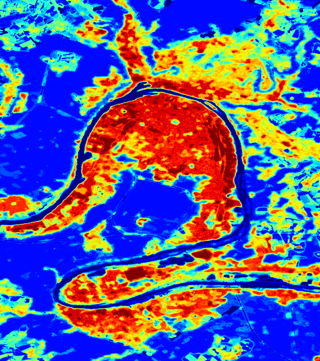

# Projet Odi-C

Le Projet Odi-C est un outil de détection des îlots de chaleur urbains basé sur l'analyse de deux types d'images satellites, à savoir les relevés de températures infrarouges et les relevés de végétation. Ce projet a été développé dans le cadre du Datathon 2023 organisé par la Région Normandie.



## Table of Contents

1. [Introduction](#introduction)
2. [Installation](#installation)
3. [Utilisation](#utilisation)
4. [License](#license)

## Introduction

Le Projet Odi-C marque mes débuts dans le domaine de Python et de la datascience. L'objectif principal était de créer un outil de détection des îlots de chaleur urbains dans les grandes métropoles normandes, dans le cadre du Datathon organisé par la Région Normandie en décembre 2023.

Pour atteindre cet objectif, j'ai utilisé des images satellites open source, notamment les relevés de températures infrarouges provenant du satellite américain LandSat 8 (avec une résolution de 100 mètres) et les relevés de végétation ('Plant Phenology Index' et 'Fraction of Absorbed Photosynthetically Active Radiation', d'une résolution de 10 mètres) provenant du satellite européen Copernicus.

Le processus impliquait le traitement et la superposition de ces images pour obtenir une image multidimensionnelle sous forme de matrice. J'ai ensuite appliqué l'algorithme de machine learning des k-means pour identifier différents clusters et localiser les îlots de chaleur. À partir de ces résultats, j'ai généré une nouvelle image que j'ai superposée à une carte.

Dans ce répertoire, vous découvrirez les notebooks Jupyter qui ont été utilisés pour mener à bien cette tâche. J'ai réalisé de nombreuses expériences sur les images satellites de la métropole de Rouen avant d'obtenir un résultat satisfaisant. Une fois mon protocole expérimental établi, j'ai reproduit l'expérience sur Le Havre. Bien que je n'aie pas eu suffisamment de relevés de température pour produire un résultat convaincant, cela m'a permis de peaufiner mon code. Ainsi, les notebooks présentent le code de l'expérience menée sur la ville du Havre. Si vous souhaitez réitérer cette expérience, je vous invite à suivre attentivement les étapes expliquées ci-dessous.

## Installation

Pour installer et exécuter le projet, suivez les étapes ci-dessous :

1. Environnement Python :

Assurez-vous d'avoir Python installé sur votre système. Vous pouvez télécharger la dernière version de Python depuis le site officiel de Python.

2. Bibliothèques Python :

Ouvrez un terminal dans le répertoire du projet.

Utilisez la commande suivante pour installer les bibliothèques nécessaires :

```bash
pip install rasterio matplotlib numpy folium tqdm pandas seaborn scikit-learn
```

3. Jupyter Notebook :

Si vous n'avez pas Jupyter Notebook installé, vous pouvez l'installer en utilisant la commande suivante :

```bash
pip install jupyter
```

4. Exécution des Notebooks Jupyter :

Lancez Jupyter Notebook en exécutant la commande suivante dans le terminal :

```bash
jupyter notebook
```

5. Images satellites

Si vous souhaitez reproduire l'expérience, vous devrez disposer de plusieurs relevés de végétation et de température (idéalement une dizaine d'images) de la zone étudiée, couvrant la période souhaitée, sans nuages et avec une bonne résolution (idéalement 10 mètres).

En ce qui concerne la végétation, j'ai sélectionné deux indicateurs, le 'Plant Phenology Index' et la 'Fraction of Absorbed Photosynthetically Active Radiation', que j'ai trouvé sur le site du satellite européen Copernicus : https://land.copernicus.eu/en/map-viewer.

Quant aux relevés de température, j'ai récupéré les données infrarouges du satellite américain LandSat8 pour des journées chaudes d'été sur ce site : https://earthexplorer.usgs.gov/.

Une fois Jupyter Notebook ouvert dans votre navigateur, naviguez vers le répertoire contenant les notebooks du projet.

## Utilisation

Si vous souhaitez reproduire l'expérience, les fichiers nécessaires se trouvent dans le dossier 'jupyter_notebooks'. Cependant, en raison de la taille importante des rasters, je n'ai pas pu les inclure directement. N'oubliez pas de modifier la variable "paths" pour qu'elle corresponde au chemin vers vos propres fichiers.

Chaque étape génère des fichiers intermédiaires, ce qui peut sembler un peu lourd, mais cela facilite le processus de retour en arrière en cas d'erreur.

Voici les étapes à suivre pour créer votre propre outil de détection des îlots de chaleur :

1. Découpe initale :

Les images brutes récupérées couvrent une vaste zone, présentant des dimensions considérables et donc une taille importante. Dans le notebook 'decoupe_initiale.ipynb', j'ai effectué un 'zoom' manuel sur la zone qui m'intéressait particulièrement. Pour chaque image, les limites de la zone d'intérêt ont été définies manuellement, permettant ainsi de générer un nouveau raster avec les coordonnées géographiques correspondantes. La découpe initiale est volontairement large et grossière, une découpe plus précise sera réalisée ultérieurement.

Axe d'amélioration possible : déterminer les coordonnées géographiques de la zone qui nous intéresse et automatiser cette étape.

2. Normalisation et nettoyage des données :

Une fois les images redimensionnées, le processus nécessite une étape de nettoyage des valeurs aberrantes, comme décrit dans le notebook 'Normalisation.ipynb'. Pour chaque image, j'ai choisi de remplacer le bruit par la valeur moyenne. Concernant les valeurs les plus basses, généralement associées à des zones d'eau, et les valeurs anormalement élevées, j'ai opté pour une "resserrement" de ces valeurs autour des moyennes afin de réduire les amplitudes des valeurs. Ces choix sont personnels, et il vous est possible d'implémenter un nettoyage plus rigoureux en fonction de vos besoins.

3. Alignement des rasters :

Cette étape est cruciale pour pouvoir superposer les images et créer le dataset. Les images provenant de satellites différents ne partagent pas le même format d'encodage pour leurs coordonnées, et elles n'ont pas été prises sous le même angle. Les étapes du fichier 'alignement.ipynb' vous permettront de reprojeter toutes les images dans un alignement commun avec des coordonnées identiques.

4. Découpe finale :

Une fois l'étape précédente réalisée, il est possible que certaines images présentent des zones sans données en raison des rotations effectuées. Dans cette phase, l'objectif est de réaliser une découpe finale de toutes les images de manière uniforme, de sorte qu'aucune image ne comporte de pixels sans information. Vous retrouverez les fonctions de découpe dans 'decoupe_finale.ipynb'

5. Création du dataset et analyse :

Une fois les données mises en forme, vous pourrez réaliser votre dataset composé de votre image multidimensionnelle sous forme de matrice à l'aide des fonctions présentes dans le fichier 'k-means.ipynb'.

Ensuite, j'ai choisi d'appliquer à mon dataset l'algorithme de Machine Learning des k-means. Après avoir testé différents nombres de clusters, j'ai opté pour une découpe de mes données en 20 ensembles, obtenant ainsi un résultat assez détaillé. Par la suite, j'ai regroupé dans un seul et même cluster les zones non urbaines fortement végétalisées (forêt, champs...) et dans un autre les zones aquatiques (fleuve, lac). Enfin, j'ai renuméroté mes clusters en les classant du plus chaud au plus frais. De cette manière, une fois qu'une image est générée à partir du résultat, en appliquant une colormap, j'ai réussi à mettre en évidence les îlots de chaleur.

Axe d'amélioration possible : il serait intéressant d'appliquer d'autres algorithmes de Machine Learning non supervisé au dataset afin d'observer si les résultats varient.

6. Mise en forme du résulat :

Dans le fichier 'mapping_icu.ipynb', vous trouverez les étapes et les fonctions nécessaires pour mettre en forme le résultat obtenu sur une carte interactive.

##Licence

MIT License

Copyright (c) 2024 Chloé Masse
